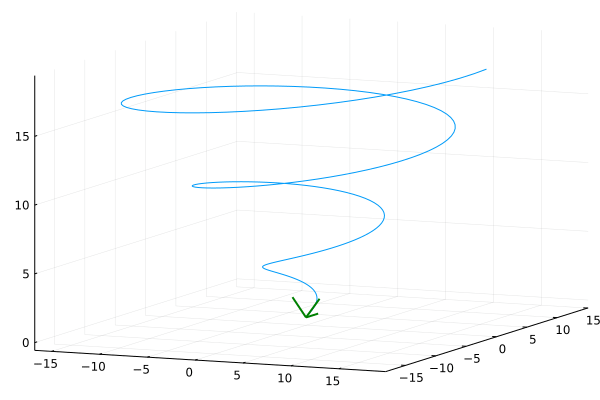

# frenet-trihedron
Visual representation of the Frenet Trihedron for a parametric space curve.

[ Rappresentazione grafica del Triedro di Frenet per curve parametriche nello spazio. ]

The beautiful thing that on wikipedia is known as [Frenet and Serret formulas](https://en.wikipedia.org/wiki/Frenet%E2%80%93Serret_formulas).

## Usage
In the file frenet.jl set these things:

1. n: number of points to plot
2. t: interval of definition of the curve
3. f(t): first component of the curve (written in hers parametric equation)
4. g(t): second component of the curve
5. h(t): third component of the curve
6. molt: the coefficient to determine the magnitude of the vectors of the trihedron
7. the first and second derivatives of the components

which appears in the first lineso of the script.

```julia
n = 200
t = range(0, 6pi, length=n)
# γ(t) = ( f(t), g(t), h(t) )
f(t) = t*cos(t)
g(t) = t*sin(t)
h(t) = t
molt=2.0
# Derivatives of f,g,h
f1(t)=cos(t)-t*sin(t)
f2(t)=-sin(t)-sin(t)-t*cos(t)
g1(t)=sin(t)+t*cos(t)
g2(t)=cos(t)+cos(t)-t*sin(t)
h1(t)=1
h2(t)=0
```

## Examples
γ(t) = ( t\*cos(t), t\*sin(t), t )

