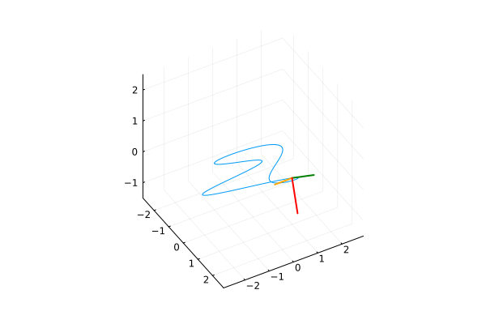

# frenet-trihedron
Visual representation of the Frenet Trihedron for a parametric space curve.
The beautiful thing that on wikipedia is known as [Frenet and Serret formulas](https://en.wikipedia.org/wiki/Frenet%E2%80%93Serret_formulas).

## Usage
Creata a `data.jl` file in which put the curve definition, i.e.:

1. n: number of points to plot
2. t: interval of definition of the curve
3. the three components of the curve
4. the first and second derivatives of the components

where we think of the curve as written in hers parametric equations, so γ(t) = (f(t), g(t), h(t)).

While in the section *Graphical parameters* of the main file `frenet.jl` you have to experiment a bit, tuning the following variables, until you get a nice plot:

1. molt: the coefficient to determine the magnitude of the vectors of the trihedron (as they should be versors, but to have a better visualization they need to be scaled according to the context dimension, ie morally the space occupied by the curve)
2. limx, limy and limz the axes range for where put the plot (default values however are already provided)
3. cam_height and cam_angle to set the camera placement (as maybe different views give better results)

## Examples
> γ(t) = (t\*cos(t), t\*sin(t), t)

> γ(t) = (cos(t)^2, cos(t)\*sin(t), sin(t))

> γ(t) = (cos(t)+sin(2t), sin(t)+cos(3t), sin(t)*cos(t))

