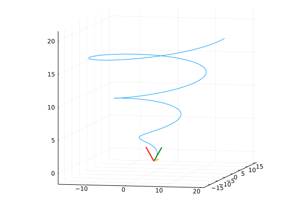
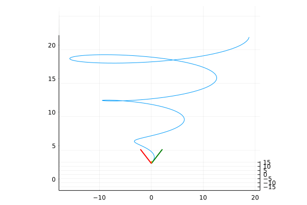
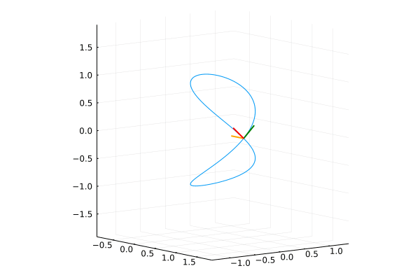
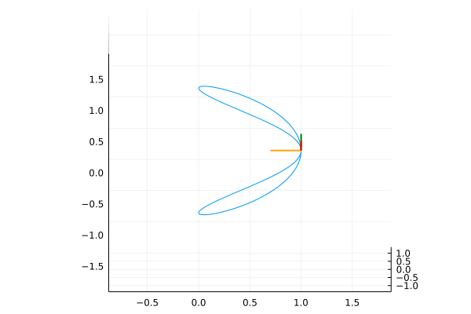

# frenet-trihedron
Visual representation of the Frenet Trihedron for a parametric space curve (*in italian*: Rappresentazione grafica del Triedro di Frenet per curve parametriche nello spazio).

The beautiful thing that on wikipedia is known as [Frenet and Serret formulas](https://en.wikipedia.org/wiki/Frenet%E2%80%93Serret_formulas).

## Usage
In the file `frenet.jl` in the section *Parameters for the curve* set these things:

1. n: number of points to plot
2. t: interval of definition of the curve
3. the three components of the curve
4. the first and second derivatives of the components

Where we think of the curve as written in hers parametric equations, so γ(t) = (f(t), g(t), h(t)).
while in the section *Graphical parameters* you have to experiment with the following variables until you get a nice plot:

1. molt: the coefficient to determine the magnitude of the vectors of the trihedron
2. limx, limy and limz the axes range for where put the plot
3. cam_height to set, well, the height of the camera

And in the main for loop you can uncomment a line to make the camera turn around the curve during the plot (and conseguent gif creation) procedure.

## Examples
γ(t) = ( t\*cos(t), t\*sin(t), t )

γ(t) = ( cos(t)^2, cos(t)\*sin(t), sin(t) )

