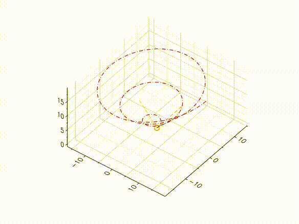

# frenet-trihedron
Visual representation of the Frenet Trihedron for a parametric space curve

## Usage
In the file frenet.jl set the variables:
1. n: number of points to plot
2. t: interval of definition of the curve

and the parametric equation for the curve itself:
3. f(t): first component of the curve
4. g(t): second component of the curve
5. h(t): third component of the curve

## Example
γ(t) = (t*cos(t), t*sin(t), t )

γ(t) = (t, t*sin(t), exp(-t^2) )
.gif)
